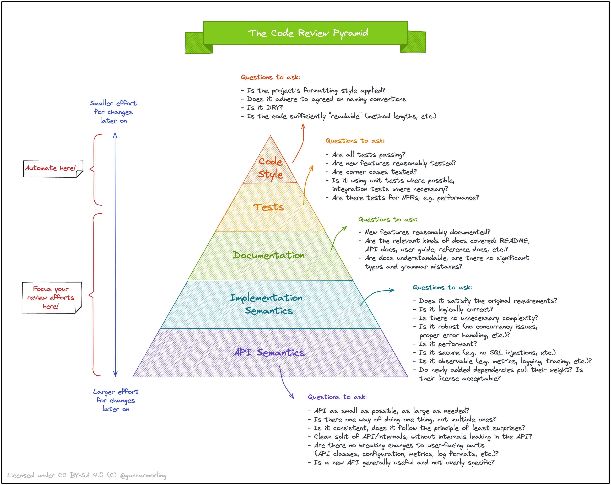

# Pull Request Review guidelines

> A repository with pull request guides.

## Review pyramid

## New function

* Does the name describes what the function does?
* Is there only one reason for a change?

## Conventions

* To vs. As (_`ToModel()` vs. `AsModel()`_), To creates a new instance (_new memory_), As means casting existing memory (_reinterpreting existing memory as something else_)

## Links

[Review pyramid source](https://www.morling.dev/blog/the-code-review-pyramid/)
